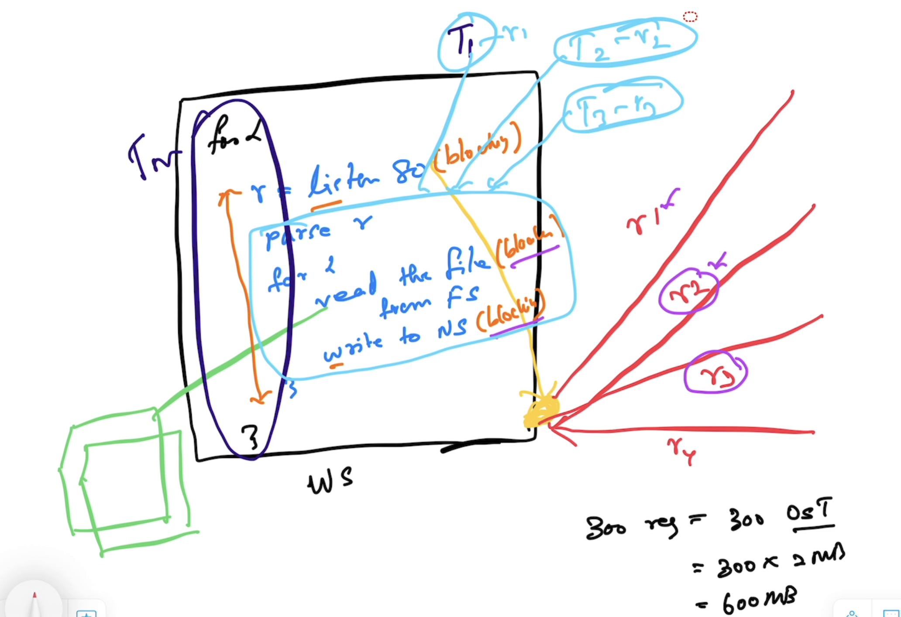

# Advanced Go

## Duration
- 3 Days

## Magesh Kuppan
- tkmagesh77@gmail.com

## Schedule
| What | When |
| ----- | ---- |
| Commence | 9:00 AM |
| Tea Break | 10:30 AM (20 mins) |
| Lunch Break | 12:30 PM (1 hour) |
| Tea Break | 3:00 PM (20 mins) |
| Wind up | 5:00 PM |

## Methodology
- No powerpoint
- Code & Discussion

## Software Requirements
- Go Tools (https://go.dev/dl)
- Visual Studio Code (or any other editor)

## Repository
- https://github.com/tkmagesh/cisco-advgo-jul-2025

## Prerequisites
- Data Types
- Variabales, Constants, iota
- if else, switch case, for
- Functions
    - Named results
    - Anonymous Functions
    - Higher Order Functions
        - Function types
        - Passing functions as arguments
        - Returning functions as return values
    - Error Handling
    - Panic & Recovery
    - Structs & Methods
    - Struct Composition
    - Interfaces
    - Modules & Packages

## Coverage
- Recap
    - iota
    - Higher Order Functions
    - Panic & Recovery
    - Interfaces
- Concurrency 
- Http Services
- GRPC
- Testing
- Profiling

## Recap
### iota
    - Auto generation of constants
### Higher Order Functions
- Can also treat functions as `data`
    - Assign functions as values to variables
    - Pass functions as arguments
    - Return functions as return values

### Panic & Recovery
#### Panic
- State of the application where the application execution cannot proceed further
- Use `panic()` function to raise application specific panics
- Typically, the runtime attempts to shutdown the app when a panic occurs AFTER executing all the deferred functions
#### Recover
- Use `recover()` function to recover from the panic (to prevent the application from shutting down)
- Apt to use the `recover()` in `deferred` functions

### Interface

## Concurrency
- Concurrency is NOT parallelism
- Design of the application in such a way the app has more than one execution path
- Typically achieved using OS Threads
- OS Threads are very costly (1 OST = ~2MB)

### **Cooperative Multitasking**

----

### **Preemptive Multitasking**

----
### **Web Server (Concurrency Example)**

----
### **Go Concurrency Model**

----
### **OS Threads Vs Goroutines**

----

## Go Concurrency
- Concurrency support is offered through the `language`
- Built-in scheduler (works based on `cooperative multitasking`)
- Language Features
    - `go` keyword
    - `chan` data type
    - `<-` operator
    - `range` keyword
    - `select-case` construct
- Standard Library support
    - `sync` package
    - `sync/atomic` package

### sync.WaitGroup
- Semaphore based counter
- It has the ability to block the execution of a function until the counter becomes 0

### Channel
- data type supported by the language to enable communication between goroutines
- "Share memory by communicating" strategy
#### Declaration
```go
var ch chan int
```
#### Initialization
```go
ch = make(chan int)
```
#### Declaration & Initialization
```go
var ch chan int = make(chan int)
// OR
var ch = make(chan int)
// OR
ch := make(chan int)
```
#### Send Operation (using <- operator)
```go
ch <- 100
```
#### Receive Operation (using <- operator)
```go
data := <-ch
```
#### Channel Behaviors


### Context
- Cancel Propagation
- All context types inherit from interface `context.Context`
- `context.Context`
    - `Done()` - returns a channel that gets unblocked when a cancel signal is received
- Creation
    - Root context
        - `context.Background()`
    - context children
        - `context.WithCancel(parentCtx)`
            - returns a context & cancel function
            - programmatic cancellation
            - invoking the returned `cancel` function will send the "cancellation" signal to all the context children

        - `context.WithTimeout(parentCtx, ...)` [relative time]
        - `context.WithDeadline(parentCtx, ...)` [absolute time]
            - returns a context & cancel function
            - Time based cancellation
            - automatically sends cancellation signal when timeout occurs
            - can also be overriden by invoking the `cancel` function

        - `context.WithValue(parentCtx, ...)`
            - returns a context
            - non-cancellable
            - used for sharing data across context hierarchies

## Database Programming
### database/sql package
### sqlx
    - high level apis abstracting all the low level complexities of database/sql
### sqlc
    - code generator
    